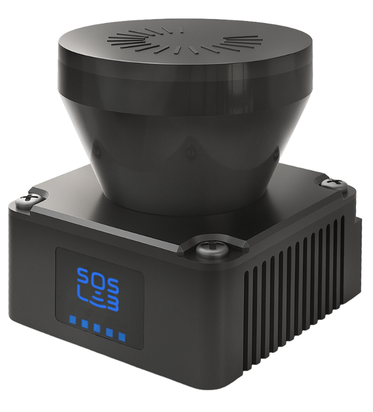
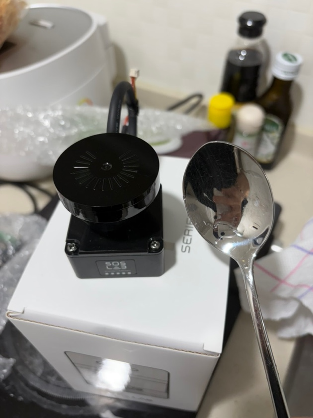
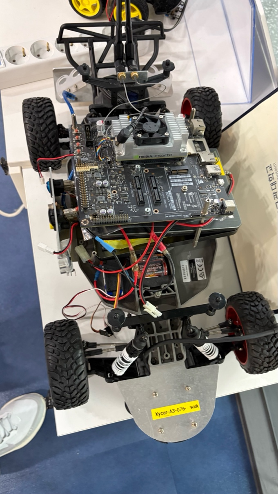
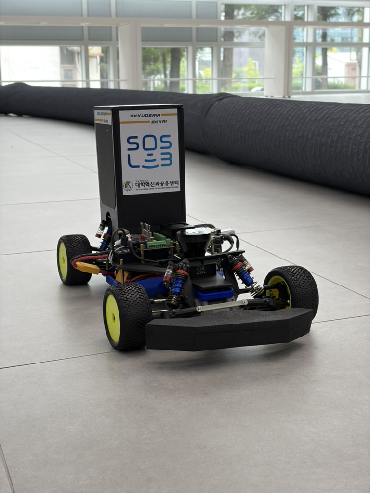
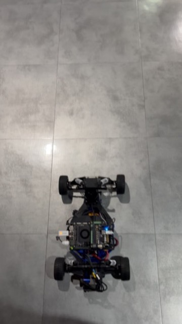

*SKKUDERIA_SKKAI의 100% 국산 라이다를 활용한 하드웨어 제작기 (feat. SOSLAB)*

안녕하세요, 저희는 이번 IFAC Roboracer 2026에 처음 출전했던 성균관대학교 인공지능학회 SKKAI 모빌리티팀 소속 SKKUDERIA_SKKAI 팀 입니다.

대회장에서는 저희의 하드웨어를 소개하는게 맞나 싶을 정도로 완성도 높은 차량들이 많았지만, 저희처럼 대회를 처음 준비하는 분들께 조금이나마 도움이 되고자 초라한 저희 차량의 하드웨어를 소개드립니다.

## 하드웨어 부품 리스트

0. LiDAR: SOSLAB GL5 (2D)
1. Chassis: Traxxas Slash 2wd
2. Onboard PC: NVIDIA Jetson Orin Nano Super(6 core, 8gb VRAM)
3. Motor: Traxxas Velineon Brushless 3500
4. Servo: Highest B210
5. ESC: VESC6 MKVI
6. Wheels: Friction1/10 4WD Elec. Offroad Buggy Rear Rubber Tyre Unglued
7. UBEC: Hobbywing-5A-V2-Air
8. Battery: VEGA 3300 4s LiPo

저희는 기존 보유 장비와 중고 부품을 적극적으로 활용했기 때문에 100만원으로 참여가 가능했습니다. 특히 가장 고가의 부품인 LiDAR는 SOSLAB의 지원을 받아 참여했습니다.

## 0. LiDAR: SOSLAB GL5

저희 차량의 핵심 부품입니다.

보통 이 대회에서는 Hokuyo라는 일본 회사의 2D 라이다나, Livox라는 중국 회사의 3D라이다를 사용합니다.

하지만 저희는 ⭐️⭐️100프로 대한민국산⭐️⭐️ 라이다를 달고 출전하였습니다.

이름하여 SOSLAB의 GL5라는 라이다 입니다.

GL5는 9m의 가시거리와 40Hz의 Scan Rate, 270도 FOV를 가진 2D 라이다입니다.

저희는 약 10m/s까지 테스트 했으며, 해당 속도에서도 Localization이 잘 될만큼, 안정적인 라이다입니다.

또한 매우 컴팩트한 사이즈의 라이다인데, 얼마나 컴팩트 하냐면,

라이다가 밥숟가락 만하다면 믿어지십니까?

Roboracer는 1:10 스케일의 차량을 사용합니다. 물론 차량 크기 규정에만 맞게 차량을 크게 만드는 것을 추천드리지만, 저희가 사용한 샤시는 작았기 때문에 컴팩트한 사이즈의 센서가 필요했습니다.

이 제품은 아직 출시 전의 제품이지만, 운 좋게도 SOSLAB에서 양산 전 테스트제품을 보내주셔서 써볼 수 있게 되었습니다.

출시 예정 가격도 200만원이 넘는 Hokuyo보다 훨씬 저렴하다고 하니, 앞으로 더 많은 팀이 부담 없이 사용할 수 있을 것 같습니다. 이번 대회에서는 56개 팀 중 유일하게 SOSLAB 라이다를 사용했는데, 앞으로 더 많은 팀이 국산 라이다를 달고 달리는 모습을 볼 수 있으면 좋겠습니다.

SOSLAB은 GL5 외에도 많은 2D, 3D라이다를 양산하고 있습니다. 국제 대회에서는 평면이 아닌 길도 달린다고 하니, 3D라이다를 고려하고 계신 분들도, 고려해보시면 좋을 것 같습니다.

## 1. Chassis: Traxxas Slash 2wd

우선, ⭐️⭐️절대 저희처럼 후륜구동 샤시를 쓰지 마십시오.

저희는 예산 부족으로 인해 동아리방에 있던 유물을 살려서 써야해서 어쩔 수 없이 썼지만, 56개의 팀 중 후륜구동 샤시를 쓰는팀은 저희 포함 2팀 남짓이었습니다.

게다가 이번 대회는 노면이 미끄러워서, 속도를 조금만 올려도 차가 돌았습니다.

저희는 순정 섀시에 LCG 키트를 구해서 장착했습니다. 지상고와 무게중심을 낮추기 위함이었는데, 이또한 추천드리지 않습니다. 저희보다 차체가 낮은 팀이 없었습니다. 또한 후술할 휠 크기와도 연관되어있습니다.

아무튼 저희는 이랬던 유물 섀시를

3d프린터로 덱을 뽑아 이렇게 바꾸어 주었습니다.

## 2. Onboard PC: NVIDIA Jetson Orin Nano Super

GPU를 사용하려고 샀는데, 저희는 LiDAR 기반의 알고리즘을 사용했기 때문에 GPU 연산을 거의 사용하지 않았습니다.

결과적으로 Jetson Orin Nano Super의 GPU 성능을 충분히 활용하지 못했습니다. 만약 LiDAR 기반 classical algorithm을 사용할 예정이라면 GPU 성능보다는 CPU 성능과 I/O 등을 우선적으로 고려하는 것을 추천드립니다.

또한 대회 환경에서는 수백명이 한 공간에 있으므로, 원격으로 차량을 작동시키고 시각화 툴을 보실 예정이라면 온보드 PC와, 원격으로 사용하실 PC 모두 통신모듈의 성능을 잘 보고 준비하시는 것을 추천드립니다.

그리고 무조건! 그에 맞는 공유기를 미리 구매해서, 사설망을 만들어 두시는걸 추천드립니다.

## 4. Servo: Highest B210

처음에는 저렴하고 토크가 약한 서보를 사용했는데, 해상도가 좋지 않아서 해당 서보를 추가구매 하였습니다.

처음부터 토크가 높고 속도가 빠른 서보를 구매해서 이중투자가 없도록 하시는 것을 추천드립니다.

해당 서보는 VESC에서 인가해 줄 수 있는 전압보다 더 높은 전압을 필요로 합니다.

따라서 커스텀 배선 제작 및 UBEC 구매가 필요할 수 있습니다.

## 6. Wheels: Friction1/10 4WD Elec. Offroad Buggy Rear Rubber Tyre Unglued

이 또한 차체를 낮추고자, 작은 사이즈의 휠을 장착했습니다.

하지만 작은 사이즈의 휠은 폭이 좁아 접지력이 오히려 좋지 않은 것 같습니다.

차체를 낮추기보다는, 1:8 스케일 RC카에 사용되는 광폭 휠타이어를 구매하셔서 접지력을 높이는 것을 추천드립니다.

## 그래서 차를 다시 만든다면?

만약 다시 처음부터 차량을 제작한다면 저희는 다음과 같이 구성할 것 같습니다.

* Chassis: 4WD 기반 1:8급
* Onboard PC: CPU 성능이 높은 보드(NUC 등)
* Servo: 처음부터 고토크·고속 제품
* Wheel: 넓은 접지면을 가진 타이어

저희가 뛰어난 성과를 보인 팀은 아니었지만, 저희의 글이 준비를 하시는데 미약하게나마 도움이 되기를 바라며, 다음에는 저희 팀의 소프트웨어 구현기로 돌아오겠습니다.

## Cookie

무조건 범퍼를 처음부터 달아두세요. 이유는.. 저희도 알고싶지 않았습니다..

