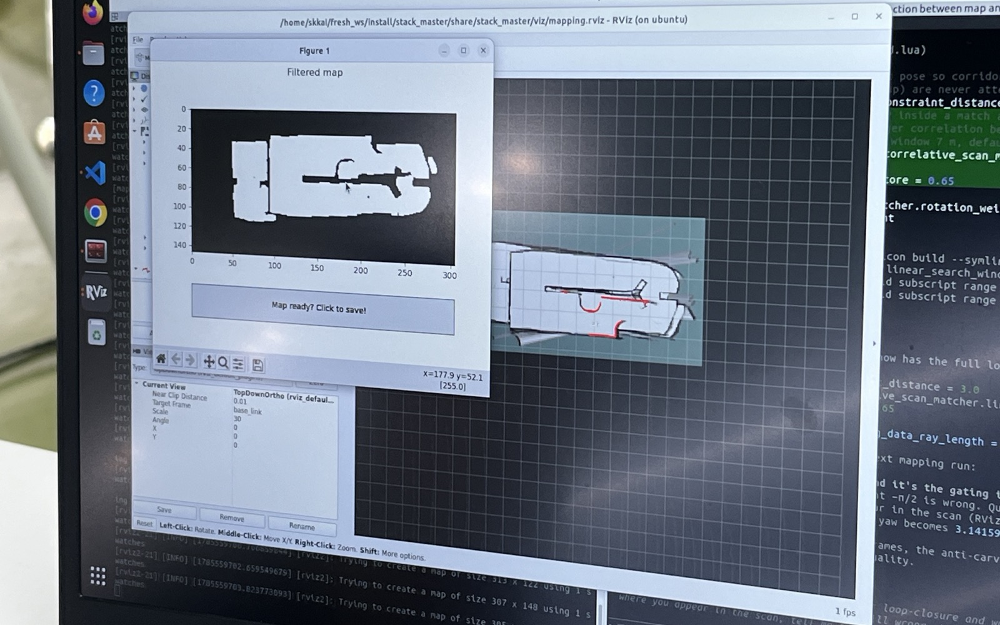

안녕하세요, IFAC Roboracer 2026에 처음 출전했던 성균관대학교 인공지능학회 SKKAI 모빌리티팀 소속 SKKUDERIA_SKKAI 팀 입니다.

지난 글에서는 100만 원이라는 제한된 예산으로 제작한 저희 차량의 하드웨어를 소개해 드렸습니다. 이번 글에서는 그 차량을 실제로 달리게 만들기 위해 저희가 소프트웨어를 구현한 과정을 설명하고자 합니다.


## 0. 어떻게 시작할지 막막하다면

차를 제작하고 굴리기까지 전 과정이 꽤 방대하기 때문에 막막할 수 있습니다.

우선 대회 공식 자료로 소개되는 Penn의 유튜브 강의와 학습 자료로 기초 이론을 익히며, Perception-Planning-Control 전체 구조를 파악하시길 바랍니다.

* [https://roboracer.ai/learn](https://roboracer.ai/learn)


## 1. 우리 팀의 base code

저희 팀은 ForzaETH 팀의 논문과 오픈코드를 베이스로 삼아 시작했습니다.

* 논문: [https://arxiv.org/pdf/2403.11784](https://arxiv.org/pdf/2403.11784)
* 코드: [https://github.com/ForzaETH/race_stack](https://github.com/ForzaETH/race_stack)

ROS 2 Humble / Ubuntu 환경에서 코드 작업을 했습니다.


## 2. SOSLAB GL5 LiDAR 연결

기존 ForzaETH 스택은 Hokuyo LiDAR를 기준으로 구성되어 있습니다. Hokuyo는 드라이버(urg_node)가 `/scan` 토픽으로 LaserScan 메시지를 직접 발행하고, 스택의 모든 모듈(cartographer, detection, FTG 등)이 이 LaserScan을 그대로 소비하는 구조입니다.

반면 저희가 사용한 GL5는 3D LiDAR라서 드라이버가 PointCloud2를 냅니다. 즉 센서를 바꾸는 순간 "드라이버만 교체"가 아니라, PointCloud2를 LaserScan으로 변환해 기존 스택에 공급하는 브리지 구조를 새로 짜야 합니다.

이 구조 변화가 GL5 연동의 핵심이고, 아래 작업들은 전부 여기서 파생됩니다.

### 2.1 SDK 빌드와 pre-built 드라이버 패키지

SOSLAB SDK는 공식 저장소를 클론해 CMake로 빌드하면 됩니다.

* [https://github.com/SOSLAB-github/SOSLAB_SDK](https://github.com/SOSLAB-github/SOSLAB_SDK.git)

빌드하면 shared library(`libLidar_x64_release.so`)와 헤더가 나오는데, 이걸 스택 빌드 때마다 다시 컴파일할 이유는 없습니다. 저희는 SDK 빌드 산출물과 드라이버 노드 바이너리를 `prebuilt/`에 담은 별도 패키지를 만들었습니다.

```text
sensors/soslab_gl5_driver_prebuilt/
├─ prebuilt/          # libLidar_x64_release.so + 드라이버 노드 바이너리
└─ CMakeLists.txt     # 빌드 없이 install만 수행
```

colcon 빌드 시 이 패키지의 CMakeLists.txt는 컴파일을 전혀 하지 않고 pre-built 바이너리를 install 경로에 복사하는 역할만 합니다. SDK 빌드 환경과 스택 빌드가 완전히 분리되어, 팀원 누구나 SDK 의존성 없이 스택을 빌드할 수 있습니다.

⭐️ 한 가지 주의할 점: 대부분의 저장소 `.gitignore`에는 `*.so` 규칙이 있어서 pre-built 라이브러리가 커밋에서 빠집니다. 저희도 `git add -f`로 강제로 추가해야 했습니다. clone 받은 팀원의 차만 안 움직인다면 이것부터 의심해보세요.

### 2.2 bringup 배선: 드라이버부터 /scan까지

토픽 연결은 f1tenth_system(저희는 포크해서 서브모듈로 사용)의 `bringup_launch.py`에서 이루어집니다. 원본에서 urg_node를 빼고 다음 네 가지를 넣었습니다.

1. **GL5 드라이버 노드** — `sensors.yaml`에서 파라미터를 로드해 `/soslab/pointcloud` 발행
2. **static TF laser → laser_raw** — GL5 좌표계 보정 (아래 2.3)
3. **pointcloud_to_laserscan 노드** — `/soslab/pointcloud` → `/scan`. cartographer, FTG 등 기존 스택이 소비하는 메인 스캔
4. **intensity 필터를 거친 두 번째 pointcloud_to_laserscan** — → `/scan_obs`. detection 전용 스캔으로, 반사 강도 기준으로 걸러낸 포인트만 사용

이렇게 하면 기존 스택 입장에서는 여전히 `/scan`이 들어오므로, 그 뒤 모듈들은 손댈 필요가 없습니다.

### 2.3 좌표계 90° yaw 보정

저희가 받은 GL5가 발행하는 포인트클라우드의 프레임은 광학 중심 기준으로 90° 돌아가 있었습니다. 그대로 쓰면 차가 보고 있는 방향과 맵에 찍히는 방향이 어긋납니다.

저희는 드라이버 출력을 `laser_raw` 프레임으로 발행하고, static TF `laser → laser_raw`로 90° yaw를 되돌려 사용했습니다.

### 2.4 FOV 경계는 ±135°로 '정확히' 맞추기

GL5의 실제 FOV는 270°(±135°)입니다. 범위를 ±π로 넓히면 후방 90° 블라인드 섹터가 측정값 없이 `inf`로 채워지는데, cartographer는 `inf`를 "레이저가 그 방향으로 나갔는데 아무것도 안 맞았다(MISS)"로 해석합니다.

이를 방지하기 위해 FOV와 정확히 맞추어줍니다.


## 3. 결국 가장 중요한 것은, Perception

Perception, Planning, Control 가운데 무엇이 가장 중요할까요?

저희가 직접 차량을 구현하고 테스트하며 내린 결론은 ⭐️ Perception ⭐️ 이었습니다.

Perception은 다시 다음과 같이 나눌 수 있습니다.

* **Mapping**: 센서 데이터로 주행 환경의 지도를 생성합니다.
* **Localization**: 만들어진 지도 안에서 차량의 현재 위치와 자세를 추정합니다.
* **Detection & Tracking**: 장애물을 탐지하고 움직임을 추적합니다.

### 3.1 Mapping

mapping 및 localization 알고리즘으로는 cartographer를 사용했습니다.

<!-- TODO: 접힌 맵 사진

-->

저희 차의 시야거리는 9m였기 때문에, 9m 이상의 특징 없는 직선 벽 트랙을 매핑할 때는 차가 현재 위치가 아까 지나온 위치라고 착각해 맵을 접어버리는 일명 맵 접힘 이슈가 있었습니다.

이럴 때는 loop-closure를 쉽게 채택하지 못하도록 matching score threshold를 높이거나, 매핑 시에만 트랙에 특징을 주는 식으로 해결할 수 있습니다.

또 라이다가 수평으로 잘 장착되어 있는지 확인해야 합니다. 라이다가 약간 아래를 보고 있으면 일정 거리 떨어진 바닥에 라이다 스캔이 찍혀 장애물이 앞에 있다고 생각할 수 있습니다. 또 라이다가 약간 위를 보면 라이다 스캔이 실제 거리보다 멀리 찍히거나 맵 밖을 보게 될 수 있습니다.

차에 눈을 똑바로 달아줍시다.

### 3.2 Localization

Perception 중 가장 중요한 것은 바로 이 ⭐️ Localization ⭐️ 입니다.

차가 자신의 위치와 상태를 정확히 알고 있어야 합니다! Planner는 "차량이 지도 위 어디에 있는지를 기준으로" 경로를 만들거나 선택하고, Controller 역시 "현재 위치"와 목표 경로 사이의 오차를 바탕으로 명령을 계산하기 때문입니다.

차가 이상하게 움직일 때 겉으로는 Planner나 Controller 문제처럼 보여도 출발점은 localization 오류일 수 있습니다.

예를 들어 차가 랩 수가 늘어남에 따라 점점 안쪽으로 도는 문제가 있을 때, 차량 무게 중심이 한쪽으로 쏠려 있거나 controller 문제로 진짜 차가 안쪽으로 도는 문제일 수 있지만, pose가 바깥으로 밀려서 제어기가 안쪽으로 당기는 것일 수도 있습니다.

Cartographer나 SynPF처럼 대표적인 Localization 알고리즘의 장단점을 비교해보고, EKF를 raw IMU, LiDAR, ERPM 등의 센서 정보를 퓨징하는 단계에 쓸지 혹은 car state를 최종적으로 추정할 때 쓸지 (혹은 두 군데 모두에 쓸지) 등 car state estimation 파이프라인을 정교하게 설계하시길 권합니다.

### 3.3 Detection & Tracking

너무 단순하지만.. 차가 자기 자신을 장애물로 인식하지 않도록 해주어야 합니다. 그렇지 않으면 차가 움직일 때마다 장애물도 따라오고, 사방이 막혔다고 생각해 옴짝달싹 못하는 기묘한 광경을 보게 됩니다.

후술하겠지만 Detection 및 Tracking은 CPU 부담이 꽤 있는 작업입니다. 저희는 연산 부담을 줄이기 위해 기존 코드를 C++로 전환했습니다.

그 외에도 detect에서 latest scan을 언제 비워주는 것이 적당한지, 지난 랩에서 장애물을 봤다면 규정상 다음 랩에서도 같은 위치에 장애물이 있을 확률이 높기 때문에 다시 돌아와서 없음을 확인하기 전까지는 있다고 생각하고 주행하도록 하는 등 소소한 수정이 있었습니다.

주행 중 차량이 트랙 경계와 충돌하면서 트랙의 형태가 달라지는 상황도 고려해야 합니다. 이때 변형된 경계를 모두 새로운 장애물로 인식해서는 안 됩니다.

저희는 트랙이 밖으로 나간 경우는 무시하고, 안으로 들어온 경우 기존 벽에 붙어 있고 여러 랩에 걸쳐 같은 위치이면 track boundary로 흡수하게 해주었습니다.


## 4. CPU 자원 배분

CPU 부하 문제 역시 반드시 신경 써야 하는 부분입니다.

저희 차량의 컴퓨팅 플랫폼은 Jetson Orin Nano Super로, CPU 코어가 6개뿐입니다. 이 6개 코어를 perception, planner, controller는 물론 cartographer, 드라이버, 시각화까지 전부 나눠 쓰기 때문에 한 모듈이 CPU를 과점하면 다른 모듈이 바로 밀립니다.

CPU 부하로 `/scan`, `/tf`, localization 업데이트가 밀리면 오래된 라이다 스캔이 현재 시각의 차량 pose와 잘못 결합됩니다. 그 결과 과거 위치에서 관측한 장애물이 현재 scan에 남는, 일명 Phantom 문제가 발생합니다.

각 모듈의 정확도뿐 아니라 연산 주기, callback 지연, CPU 점유율도 함께 지켜봐야 합니다.

저희 팀의 발단은 이랬습니다. detect 노드를 40Hz로 설정했는데 실측 주기는 19.3Hz로 포화되어 있었고, 콜백 스레드가 CPU를 독점하면서 TF listener가 굶어 "extrapolation into the future" lookup 실패가 속출했습니다.

여기서부터 시도한 것들을 순서대로 공유합니다.

### 4.1 완화책

**① Python 벡터화.** detect의 adaptive-breakpoint segmentation 루프를 numpy로 벡터화했습니다. 흥미로운 건 속도 자체보다, numpy 연산 중에는 GIL이 풀려서 TF 스레드가 살아난다는 점이 핵심이었다는 것입니다. Python 노드에서 특정 스레드가 굶는 증상이 있다면 참고하세요.

**② 노드 주기 하향 (40→20Hz).** detect·tracking·controller를 달성 가능한 주기로 낮췄습니다 (Python detect는 40Hz 설정에서 CPU 약 44%). 이때 Kalman filter의 dt, waypoint-safety timeout처럼 주기에 묶여 있는 파라미터들도 함께 스케일해야 합니다.

욕심내서 10Hz까지 내려봤다가 부작용을 발견했는데, tracking(20Hz)이 같은 detection을 두 번 소비하면서 상대속도 추정이 0.67x~1.33x로 진동하고 KF가 재초기화되는 문제였습니다. 주기를 조정할 때는 모듈 간 주기 비율까지 봐야 한다는 교훈을 얻고 20Hz로 복귀했습니다.

**③ 시각화 부하 제거.** TF staleness의 근본 원인으로 지목된 것이 의외로 RViz 마커였습니다. 구독자가 있을 때만 마커를 빌드/발행하도록 바꾸고 5Hz로 스로틀했으며, 실제 local waypoint를 마커 작업보다 먼저 발행하도록 순서를 바꿔 마커가 스킵돼도 플래너 공급은 끊기지 않게 했습니다. RViz 기본 설정에서도 디버그 표시와 raw scan을 off로 두었습니다.

디버깅용 시각화가 디버깅 대상인 부하를 만들고 있지 않은지 꼭 확인해보세요.

### 4.2 구조적 해법 — 핫패스 C++ 포팅

완화책으로 버티는 데는 한계가 있었습니다.

모듈별 CPU 점유율을 분석해보니 detect, tracking, controller, spline planner 같은 핫패스(perception → planner → controller) 노드들이 부하의 대부분을 차지하고 있었고, 이 노드들을 C++로 전환하는 것으로 결론지었습니다.

detect → controller(Pure Pursuit + FTG) → tracking → spline_planner 순서로 옮겼습니다.


## 5. Planner

Localization 모듈을 잘 설계했다면 planner를 설계할 단계입니다. 사실 이 단계가 가장 재밌다고 생각합니다. 또 적절한 파라미터를 찾기 위해 가장 많이 실험을 해야 할 단계이기도 합니다.

장애물이 1m 간격으로 있을 수 있기 때문에 연속되어 존재하는 장애물도 잘 회피하는지 확인해야 합니다.

첫 번째 장애물을 회피하고 원래 global trajectory로 복귀하려는 경로상에 장애물이 있을 수 있고, 그러면 다음 장애물을 발견했을 때 이미 해당 장애물과의 거리가 너무 가까워 피할 수 없을 수 있습니다.

여기에 예상치 못한 동적 장애물(상대 차량)까지 고려해 다양한 상황을 커버할 수 있는 plan logic을 짜보세요.


## 6. Controller

저희는 Pure Pursuit Controller를 사용했습니다.

강화학습을 쓰고 싶다면 여기에 넣으시면 됩니다.


## 그래서 스택을 다시 짠다면?

돌이켜보면 화려한 Planning이나 Control 알고리즘보다 정확하고 안정적인 Perception이 먼저였습니다. 특히 Localization이 안정적이어야 이후 모듈의 문제도 올바르게 진단할 수 있었습니다.

처음 준비하는 팀이라면 모든 기능을 한꺼번에 완성하려 하기보다, 센서 입력부터 차량 출력까지 한 단계씩 검증하는 것을 추천드립니다.

실차 테스트를 해가며 발견되는 문제를 해결해나가신다면 어느새 똑똑해진 차를 만나실 수 있을 것입니다.


## Cookie

<!-- TODO: Cookie 영상 (KakaoTalk_Video_2026-09-04-16-19-23.mp4)
<video controls playsinline preload="metadata" poster="cookie.jpeg" style="max-height:460px;width:auto;max-width:100%;display:block;margin:0 auto;">
  <source src="cookie.mp4" type="video/mp4">
</video>
-->
